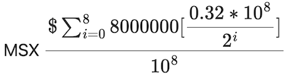

# Tokenomics

The issuance schedule of MSX tokens is the same as the Bitcoin issuance scheudle although blocks have been replaced with seconds as a measurment of time and constants have been modified to maxmize liquidity into the protocol.

| Block reward per second | Issuance  in era | Date |
| ----- | ----------------- | ------------ |
| 0.32 | 10240000.0 | June 15, 2021 01:05 PM |
| 0.16 | 5120000.0 | November 14, 2021 10:55 AM |
| 0.08 | 2560000.0 | November 19, 2022 07:48 PM |
| 0.04 | 1280000.0 | November 25, 2023 04:41 AM |
| 0.02 | 640000.0 | November 29, 2024 01:35 PM |
| 0.01 | 320000.0 | December 04, 2025 10:28 PM |
| 0.005 | 160000.0 | December 10, 2026 07:21 AM |
| 0.0025 | 80000.0 | December 15, 2027 04:15 PM |

Final block: December 20, 2028 01:08AM 

Total Tokens: 20400000.0
